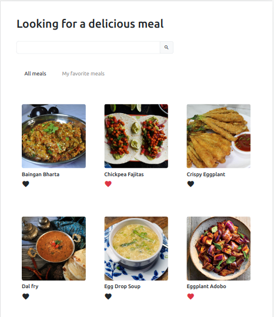
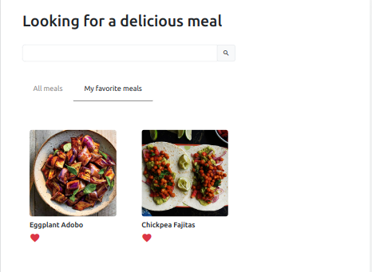
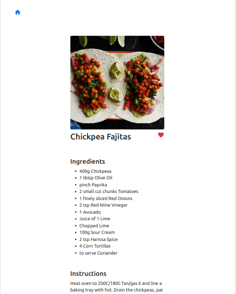

# App de receitas Vegetarianas e Veganas 

Essa aplicação está ainda em construção. Estou utilizando o framework **Vuejs** com estilização com classes do **Bootstrap** e a API pública <a href="https://www.themealdb.com/">TheMealDB</a>

 

## Para rodar a aplicação

> Rode o comando:

`npm install && npm run dev`

## O que falta fazer:

1. Arrumar texto de instruções da receita

## Tela de Favoritos
 

## Tela de detalhe da receita
 

